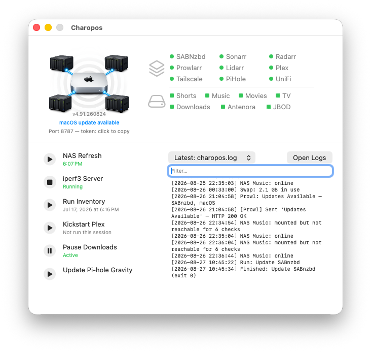
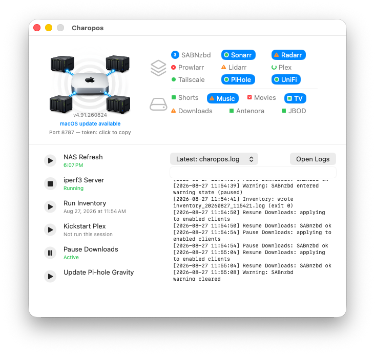
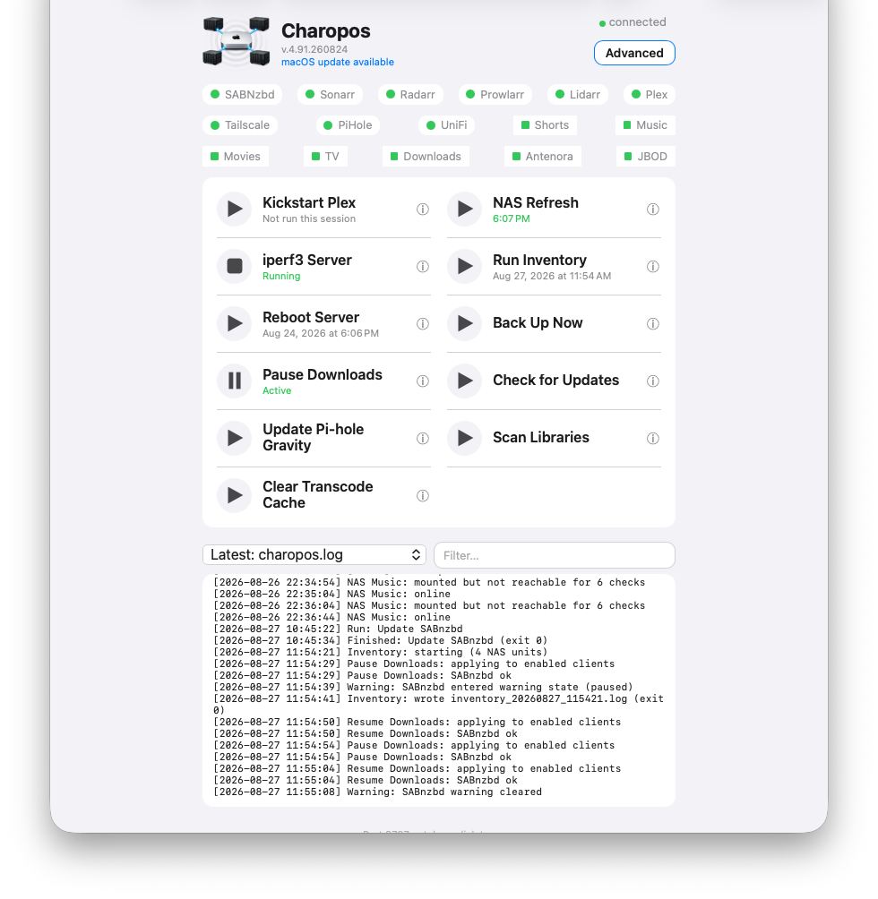
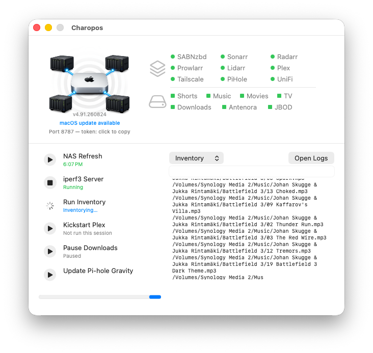
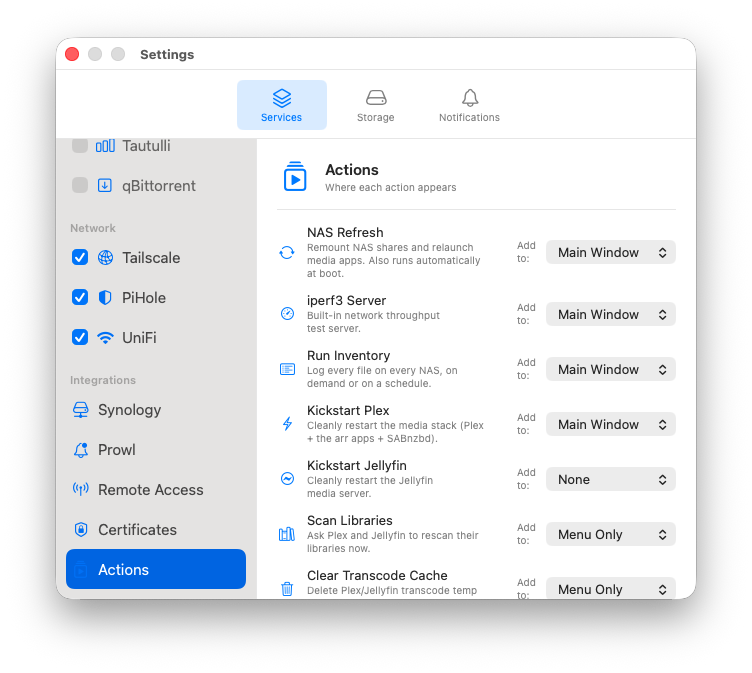

# Charopos

A macOS menu-bar app for watching over a home server — the services running on it, the NAS units and drives attached to it, and the handful of maintenance chores you'd otherwise do by hand. It also serves a web dashboard, so the same view works from a phone or any other machine on your network.

Charopos is built for the case where one Mac quietly runs a media stack and some storage, and you want to know it's healthy without SSHing in to find out.



> **Status:** works, in daily use, but it's one person's homelab tool made general. Some integrations (see [Known limitations](#known-limitations)) have never been tested against a real instance. Bug reports welcome.

## What it does

**Watches services.** A status light per service, polled every couple of seconds. Where a service exposes more than "am I up", Charopos reads that too: queue depth on the download clients, active streams on the media servers, pending requests on Overseerr, available updates on the *arr apps.

**Watches storage.** Synology NAS units over the DSM API — reachability, disk usage, and DSM's own crash/upgrade flags — plus locally mounted volumes, with alerts when one drops off or fills up.

**Watches the host.** Swap, memory pressure, external IP changes, NTP drift, SMART failures, zombie processes, Time Machine errors, UPS battery state.

**Does the chores.** One-tap actions for the things you'd otherwise script: remount NAS shares and relaunch the apps that depend on them, restart a wedged media server, run the *arr/SABnzbd/DSM updaters, rebuild Pi-hole's blocklists, kick off a Time Machine backup, clear a transcode cache that's eaten the boot drive.

**Tells you when something breaks.** Push notifications via [Prowl](https://www.prowlapp.com), each one linking back to the dashboard.

Status is never colour alone — services are circles, drives are squares, warnings are triangles, and anything with an update waiting gets a blue pill. It stays readable in greyscale, and to anyone who doesn't distinguish red from green:



## Requirements

- **macOS 13 (Ventura) or later** — but see the note on OS testing under [Known limitations](#known-limitations)
- **Xcode**, for the Swift compiler. If you've never pointed the toolchain at it:
  ```bash
  sudo xcode-select -s /Applications/Xcode.app
  ```
- A Prowl API key, if you want push notifications (optional)
- SSH key access to your Pi-hole / UniFi console, if you want the actions that drive them (optional)

Everything else is optional and discovered through settings — Charopos runs perfectly well watching two services and nothing else.

## Build and install

`build.sh` writes both apps to the **parent** of the repo folder, so clone it wherever you want the apps to end up:

```bash
cd ~/Applications
git clone https://github.com/scumbly/charopos.git
cd charopos
./build.sh
```

That produces `~/Applications/Charopos.app` and `~/Applications/Charopos Remote.app`.

The build is **ad-hoc signed** — there's no Apple Developer ID behind it — so Gatekeeper will refuse the first launch. Right-click the app and choose **Open**, then confirm. Once is enough. If you'd rather clear the quarantine flag directly:

```bash
xattr -dr com.apple.quarantine ~/Applications/Charopos.app
```

Both apps are built as universal binaries (Apple Silicon and Intel), so one clone runs on any Mac and you can copy Charopos Remote to a machine of either kind.

**Expect a short series of permission prompts on first launch** — "Charopos would like to access files on a removable volume", then a network volume, and so on. Charopos asks for these deliberately and up front, at a moment you're expecting them, rather than silently failing to see a drive later. Answer **Allow**. Each one blocks startup until you do, so if the app seems to hang on launch with nothing in its log after `Charopos … started`, look for a dialog waiting behind another window.

They come back after a rebuild. Ad-hoc signing has no stable identity — the signature is a hash of the binary, so it changes every time you build — and macOS treats each build as a new app that hasn't been granted anything yet. Nothing is wrong; click through them again.

To update later, `git pull && ./build.sh`. Quit the app first — the build can't replace a running bundle.

## First run

Charopos opens a setup flow the first time: **Welcome → Services → Storage → Actions → Notifications → Remote Access → Done**. Nothing is written until you finish, and every choice is editable afterwards in Settings.

The Services step lists everything Charopos can monitor, all unchecked. Tick what you actually run, give each one its address, and use the per-service **Test** button to confirm Charopos can reach it before you move on. Anything you leave unchecked is never polled and never appears — no permanent red lights for software you don't own.

You can re-run the whole flow later from the menu-bar item (**Run Setup Again…**).

## The three surfaces

**Menu bar and main window.** The primary interface on the server itself. The menu-bar icon takes the colour of the worst current state, so a glance at the corner of the screen is usually enough.

**Web dashboard.** Served by the app at `http://<your-mac>:8787` and readable on anything with a browser. This is the portable half of Charopos — it's plain HTML and has no macOS dependencies.

**Charopos Remote.app.** A cut-down menu-bar app for a *second* Mac, giving you the same lights and action buttons for a server sitting in another room. Copy it over, point it at the server's address, paste in the token.



## What it can monitor

**Services:** SABnzbd, Sonarr, Radarr, Prowlarr, Lidarr, Plex, Jellyfin, Bazarr, Overseerr (and Jellyseerr), Tautulli, qBittorrent, Tailscale, Pi-hole, UniFi.

**Storage:** Synology NAS units via the DSM API, and any locally mounted volume.

Services Charopos doesn't know about aren't supported as first-class integrations — the roster is compiled in, because each one needs bespoke code to read its particular notion of "healthy". Adding one means editing `Runner.serviceDefaults` and its poller.

## One-tap actions

Thirteen are available; you choose which appear and where (**None**, **Menu Only**, or **Main Window**) in Settings → Services → Actions. The main window holds six at a time.

An action reports back while it runs — a spinner on its own row, a progress bar, and its output streaming into the log pane — so you can see it working rather than guessing:



| Action | What it does |
| --- | --- |
| NAS Refresh | Remounts NAS shares and relaunches the apps that depend on them. Also runs at boot. |
| Kickstart Plex / Jellyfin | Cleanly restarts the media stack, or just Jellyfin. |
| Scan Libraries | Asks Plex and Jellyfin to rescan now. |
| Clear Transcode Cache | Deletes Plex/Jellyfin transcode temp files. |
| Check for Updates | Refreshes every update check immediately. |
| Pause / Resume Downloads | Toggles SABnzbd and qBittorrent together. |
| Search Subtitles | Asks Bazarr to search for missing subtitles. |
| Update Pi-hole Gravity | Rebuilds Pi-hole's blocklists over SSH. |
| Back Up Now | Starts a Time Machine backup. |
| Run Inventory | Logs every file on every NAS, on demand or scheduled. |
| iperf3 Server | Runs an iperf3 server for throughput testing. |
| Reboot Server | Restarts the Mac, with a force option. |

The updaters for the *arr apps, SABnzbd and DSM appear as badges on the relevant service when an update is waiting, rather than as standing buttons.



## Remote access

Off by default: on a fresh install the API listens on loopback only, reachable from nothing but the machine it runs on. Settings → Services → Integrations → Remote Access offers three scopes:

- **This Mac only** — loopback. The default.
- **Tailscale only** — binds solely to the Mac's [Tailscale](https://tailscale.com) address, so traffic is end-to-end encrypted by WireGuard and never touches the LAN in the clear. **This is the one to use.** If the tailnet is down at launch, Charopos falls back to loopback and rebinds automatically when it returns.
- **All interfaces** — the raw LAN port. Trusted networks only; see below.

Clients authenticate with a token generated on first launch. Copy it by clicking the token line under the version number in the main window; rotate it any time from Settings → Remote Access.

## Security

Charopos controls a server, so it's worth being precise about what it does and doesn't protect.

**The API speaks unencrypted HTTP.** There's no TLS on port 8787. Anyone who can watch traffic on a network where you've selected *All interfaces* can capture the token and drive the app. This is why **Tailscale only** is the recommended setting — WireGuard supplies the encryption Charopos doesn't. Treat *All interfaces* as something you turn on for a trusted LAN and think about first.

**Certificates for your local hosts are pinned.** NAS and Pi-hole boxes usually serve a certificate no public authority has signed, so there's nothing to validate against. Charopos remembers the certificate each host presents on first contact and refuses that host if it later presents a different one — the same trust-on-first-use idea as SSH host keys, and for the same reason: the DSM login carries your NAS admin password. If you deliberately replace a certificate, clear the stored one at Settings → Services → Certificates. Hosts that do have a publicly trusted certificate are validated normally, so ordinary renewals change nothing.

**Credentials sit in a plain file.** Service API keys and the DSM and Pi-hole passwords live in `~/Library/Application Support/Charopos/config.json`, mode `0600` — readable by your user account and nothing else. They are **not** encrypted and **not** in the Keychain. The Keychain binds items to an app's code signature, and an ad-hoc signature changes on every rebuild, which would mean an authorisation prompt every time you built the app; the permissive alternative has the same exposure as the file anyway. The practical consequences: anything running as you can read those secrets, and they will be copied into your Time Machine backups in the clear.

**The DSM password is sent in a URL.** Synology's authentication API takes credentials as query parameters — that's their design, not a choice Charopos makes. Certificate pinning stops it being read off the network, but it still lands in the NAS's own webserver access log. Consider giving Charopos its own DSM account with only the permissions it needs, rather than an administrator you use elsewhere.

**Nothing is notarized.** Ad-hoc signing means Gatekeeper can't verify the build, which is exactly why you have to right-click → Open. You are trusting the source you cloned.

**Charopos Remote can update itself over the network**, fetching a copy of the app from the server and replacing itself. There's no signature check on what comes back, so the transport is the only thing protecting it — another reason to prefer Tailscale. Build from source on both machines and you'll never invoke it.

Found a security problem? Please report it privately through the repository's **Security** tab → **Report a vulnerability**, rather than in a public issue. [SECURITY.md](SECURITY.md) covers what's in scope, what's already a known trade-off, and what to expect.

## Where things live

| | |
| --- | --- |
| Config (including secrets) | `~/Library/Application Support/Charopos/config.json` (`0600`) |
| API token | `launcher-remote-token.txt`, beside the app (`0600`) |
| Logs | `logs/`, beside the app (`0700`) |
| Preferences | `~/Library/Preferences/`, via UserDefaults |

Logs are also readable in the app: the dropdown in the main window switches between Charopos's own event log, the updater log, and the log of each service it can find one for.

## Configuration

Setup and Settings write the config for you, and that's the expected way to manage it. [`charopos-config.example.json`](charopos-config.example.json) is here for the cases where you'd rather see the whole shape at once — pre-seeding a machine, keeping a copy under version control, or working out why a value isn't taking effect.

Two things will bite you if you hand-edit it:

**Top-level scalars are strings, not JSON types.** It's `"diskAlertThreshold": "90"` and `"alertServiceDown": "true"`, not `90` and `true`. A real JSON boolean or number is silently ignored and the default applies — which looks exactly like the setting not working.

**Inside `nasUnits` and `localVolumes`, `suppressSpaceAlert` is a real boolean** — `false`, not `"false"`. The two conventions genuinely differ; the example has both correct.

Beyond that: a NAS entry needs `id`, `label`, `checkURL`, `openURL` and `mountPoint` or it's dropped on load; a volume needs `id`, `label` and `mountPoint`. `serviceURLs` overrides the built-in address for any service, where `url` is what gets health-checked and `openURL` is where clicking the light takes you. Tailscale has no `url` because there's nothing to poll — its state is read from the machine directly.

The example deliberately leaves out `setupComplete`, `knownServices`, `knownActions` and `disabledActions`. Those are the app's own bookkeeping — it writes them, migrates them between versions, and does the right thing when they're absent. Don't hand-write them.

Secrets live in this same file, in the clear. See [Security](#security).

## Known limitations

- **macOS only, for the server app.** It's an AppKit/SwiftUI menu-bar app; there's no Linux or Windows port and no realistic path to one. The *web dashboard* is plain HTML and works anywhere, so if you want a cross-platform view, that's it.
- **NAS support means Synology.** The storage integration talks to the DSM API. Other vendors aren't supported.
- **Some integrations are unverified.** The Jellyfin, Bazarr, and qBittorrent code paths were written against published API documentation but have never run against a live instance. They may need fixing; reports are welcome.
- **The service roster is compiled in.** See [What it can monitor](#what-it-can-monitor).
- **Only the current macOS is tested in practice.** Charopos is developed and run daily on macOS 26. Support for 13 through 15 is real in the sense that the code compiles against those SDKs with no unavailable APIs — but nobody has launched it on them, so treat older systems as plausible rather than proven. On macOS 13 the round action buttons fall back to a rounded rectangle, which is the one visual difference known in advance. Reports from older systems are welcome.

## Help

The app has a full Help window — **Help → Charopos Help**, or ⌘? — covering setup, each action, the services, notifications, remote access, and troubleshooting. It's the best place to look first.

## License

GPLv3. See [LICENSE](LICENSE).

© Jesse Holden
